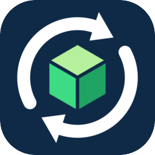
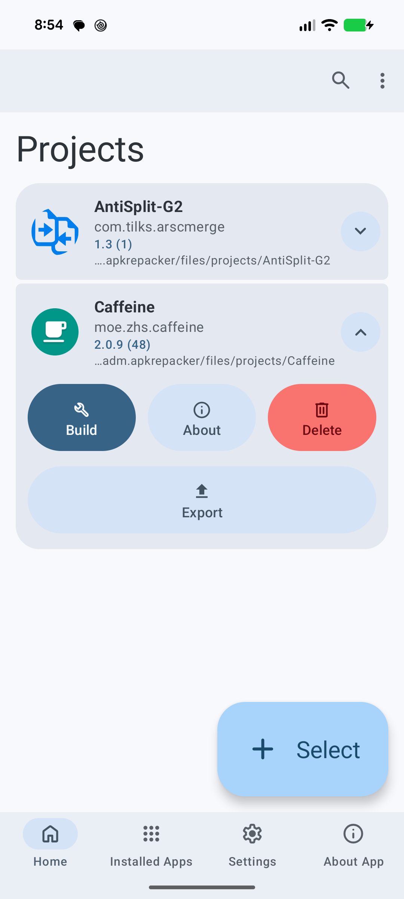
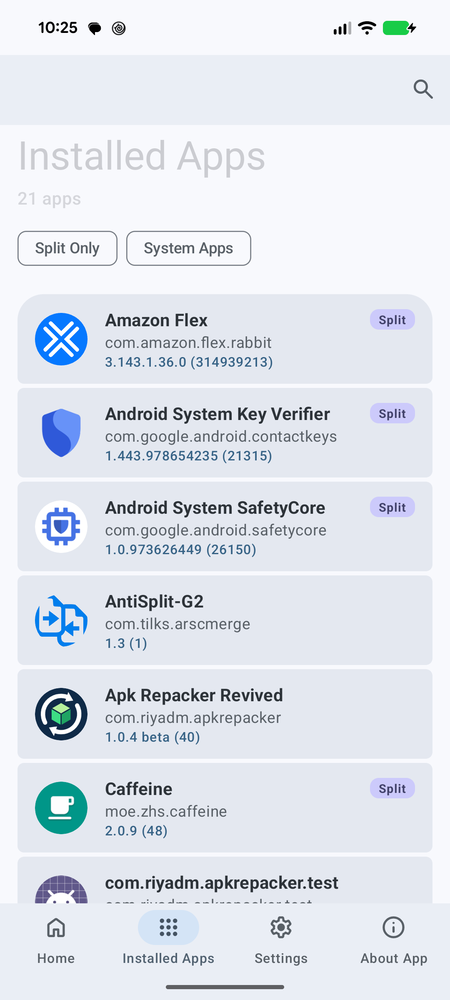
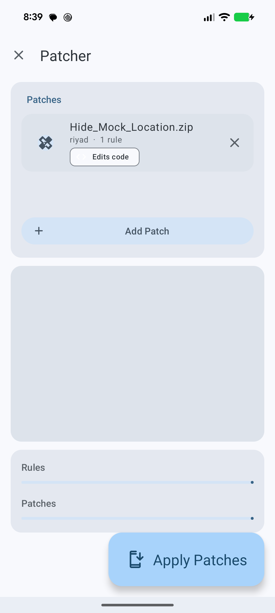
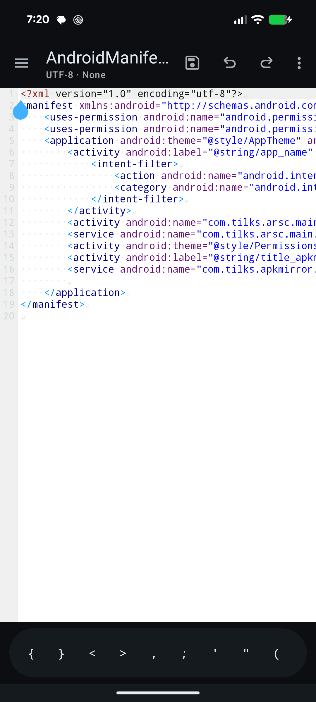

<div align="center">



# Apk Repacker Revived

**Decompile, patch, rebuild and sign Android apps. Entirely on your phone.**

[](https://github.com/riyadmondol2006/ApkRepacker-Revived/actions/workflows/release.yml)
[](https://github.com/riyadmondol2006/ApkRepacker-Revived/releases/latest)
[](LICENSE.md)


</div>

Apk Repacker Revived is an APK editor that runs on the device itself. Pick an installed app or an
APK file, decompile it with **apktool 3**, change its code or resources, rebuild it with a bundled
`aapt2`, sign it and install it. No computer needed.

It is a modernised continuation of [ApkRepacker](https://github.com/MrIkso/ApkRepacker) by MrIkso:
a new engine, a new toolchain, a reworked patcher and a full Material 3 Expressive interface.

<p align="center">
  
  
  
  
</p>

## Download

Grab the latest signed APK from the **[Releases page](https://github.com/riyadmondol2006/ApkRepacker-Revived/releases/latest)**.
Every push to `main` is built and published there automatically (see [Releases](#releases)).

On first start the app asks for **All files access** so it can read and write folders directly. It
works without it, only slower for folder export and import (see [Permissions](#permissions)).

## What it does

### Decompile and rebuild
- Decompile installed apps or APK files: resources only, code (smali) only, everything, or just unpack.
- All the usual apktool flags: only main classes, no debug info, keep broken resources, skip assets,
  force the manifest, and more. Save your choices as the default.
- Rebuild with the bundled 16 KB-aligned `aapt2`: debuggable, user-CA network security config, copy
  the original manifest and `META-INF`, no PNG crunch, force.
- Sign with v1, v2, v3 and v4 signatures, using the built-in key or your own keystore.

### Split APK apps
- Apps installed as split APKs (a base APK plus configuration splits) are marked **Split** in the
  Installed Apps list, and you get a warning before decompiling one.
- The base and its configuration splits (native libraries, density and language resources) are merged
  into a single project, and the split requirement is removed on rebuild so the result installs on
  its own. Dynamic feature splits are not included.

### Patcher
- Apply one or more `.zip` patches to the open project. Each patch is a small script
  (`patch.txt`) of rules: replace text or smali with regular expressions, add or remove files, merge
  resources and more. **[How to make patches](docs/PATCH_FORMAT.md)**.
- The patch list shows the author, the number of rules and an **Edits code** tag for each patch.
- If a patch edits smali but the project was decompiled without it, you are asked whether to
  decompile the code now, continue anyway, or cancel. Only the code is decompiled; your decoded
  resources are left alone.
- **Fast**: consecutive rules that target the same files run in a single pass, with several files
  handled at once. The result is identical to running the rules one by one (checked byte for byte
  over thousands of files). On a Pixel 8 a five-rule patch over about 5,600 smali files went from
  20 s to 2 s, and the 19-rule demo patch takes about 2 s.

### Projects: save and load
- **Export** any project as a **ZIP** (a few seconds for a 7,000-file project) or into a **folder**.
- **Import** a project from a ZIP or a folder. A folder of several projects imports them all, and
  projects made with desktop apktool load too.
- Name clashes are handled for you (`Name (2)`), and the ZIP import refuses entries that try to
  escape the project folder.

### Edit in the app
- A code editor with syntax highlighting, tabs, find and replace (regex), go to line and a symbol bar.
- File manager with image viewer, copy, move, rename and a project tree.
- Editors for strings, colours and dimens, and project-wide search.

### Works in the background
Decompiling, building, patching and exporting or importing all run as **foreground services**:

- Leave the app, lock the phone or switch apps. The work keeps going and is not killed.
- A progress notification while it runs and a **finished** notification when it ends.
- A wake lock keeps the CPU awake for the length of a job (with a time limit), and the app can ask to
  be excluded from battery optimisation so long jobs are not paused.
- Come back at any time. The screen re-attaches to the running job and its log, instead of starting
  over.

### Interface
Material 3 Expressive: spring motion, adaptive layouts (bottom bar on phones, navigation rail on wide
screens), predictive back, light and dark themes, an alternative Rena colour scheme and Material You
dynamic colour.

## Quick start

1. **Decompile**: *Installed Apps* → pick an app → *Decompile*.
2. **Edit**: open the project from *Home*; change files in the editor, or tap the patch icon to apply
   patches.
3. **Build**: tap the wrench. The signed APK is written to the output folder and offered for install.

## Permissions

| Permission | Why |
|---|---|
| All files access | Read and write folders you choose directly (fast folder export/import, file manager). Optional. |
| Notifications | Progress and finished notifications for background jobs. |
| Foreground service (data sync) | Keeps long jobs alive when the app is in the background. |
| Ignore battery optimisation | Asked once, so very long jobs are not throttled. Optional. |
| Wake lock | Keeps the CPU running during a job. Released when it ends. |
| Install / uninstall packages | Install the rebuilt app and remove the original. |
| Query all packages | List the apps you can decompile. |

## Works on every device

- **Low-RAM friendly**: bulk jobs use as many worker threads as the device's cores *and* memory
  allow (up to 8 on a flagship, 2 on a small phone), and stream data instead of loading whole
  projects into memory.
- **Built for Android 6.0 to 16** (API 23 to 36): notification permission, foreground-service types,
  scoped storage and the 6-hour data-sync limit are handled, with fallbacks for older versions.
  Developed and tested on a Pixel 8.
- Tablets and wide screens get a navigation rail and multi-column lists.

## Build from source

You need **JDK 17 or newer** and the Android SDK.

```bash
./gradlew :app:assembleDebug      # debug APK
./gradlew :app:assembleRelease    # R8-minified release APK (unsigned unless signing env vars are set)
```

APKs are written to `app/build/outputs/apk/`.

| Tool | Version |
|---|---|
| Gradle | 9.8.1 |
| Android Gradle Plugin | 9.4.1 |
| Kotlin | 2.4.20 |
| Material Components | 1.14.0 |
| apktool | 3.0.3 |

The `app` module is Kotlin only. The other modules are `codeeditor`, `colorpicker`, `common`,
`expandablerecyclerview`, `photoview` and `vectormaster`.

Projects are stored in `Android/data/com.riyadm.apkrepacker/files/projects`.

## Releases

Every push to `main` builds a **signed release APK** with GitHub Actions and publishes it as a
GitHub Release, with notes listing the new commits. To set it up for your
own fork you only add your signing key as repository secrets: **[docs/RELEASING.md](docs/RELEASING.md)**
walks through it step by step.

## About the developer

**Riyad M.** is a mobile application security consultant, security researcher and reverse engineer
based in Bangladesh, working with teams worldwide. Android security analysis, Frida scripting, SSL
pinning and integrity check bypass, and mobile forensics are the main areas of work.

| | |
|---|---|
| Website | [riyadm.com](https://riyadm.com) |
| Telegram | [@riyadmondol2006](https://t.me/riyadmondol2006) (preferred) |
| WhatsApp | [wa.me/8801711798409](https://wa.me/8801711798409) |
| Email | [riyadmondol2006@gmail.com](mailto:riyadmondol2006@gmail.com) |
| This project | [riyadmondol2006/ApkRepacker-Revived](https://github.com/riyadmondol2006/ApkRepacker-Revived) |
| GitHub | [riyadmondol2006](https://github.com/riyadmondol2006) |
| LinkedIn | [riyadmondol2006](https://www.linkedin.com/in/riyadmondol2006) |
| YouTube | [@reversesio](https://www.youtube.com/@reversesio) |
| X / Twitter | [@riyadmondol2006](https://x.com/riyadmondol2006) |
| Reversesio | [reversesio.com](https://reversesio.com) |

### Other projects

- [Android Signature & Integrity Check Bypass](https://github.com/riyadmondol2006/Android-Signature-And-Integrity-Check-Bypass)
- [Frida Sign Hook Generator](https://github.com/riyadmondol2006/Frida-Sign-Hook-Generator)
- [Android Root Detection Bypass (Frida)](https://github.com/riyadmondol2006/Android-Root-Detection-Bypass---Frida-Script)
- [SSL Root Frida Bypass](https://github.com/riyadmondol2006/SSL-Root-Frida-bypass)
- [Frida DEX Dump](https://github.com/riyadmondol2006/Frida-Dex-Dump)
- [iOS SSL Bypass & Traffic Monitor](https://github.com/riyadmondol2006/ios-ssl-bypass-and-traffic-monitor)

## Credits

Based on the original [ApkRepacker](https://github.com/MrIkso/ApkRepacker) by MrIkso. Open source
libraries are listed under **About → Licenses** in the app.

## Responsible use

Use this tool only on apps you own or have permission to modify. You are responsible for following
the law and the terms of any app you change.

## License

[GNU General Public License v3.0](LICENSE.md)
